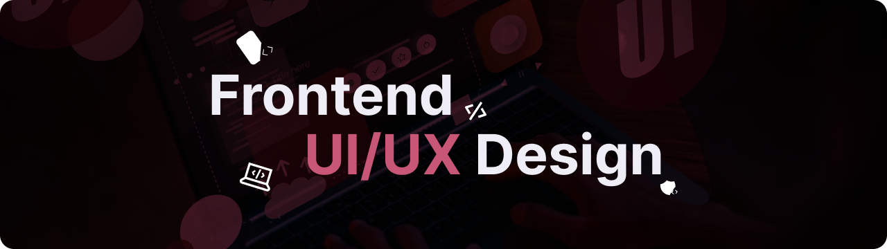

## About Me
My journey with **frontend development** began over 2 years ago. This experience has given me a solid foundation in creating websites, which now helps me design pages and interfaces to be as user-friendly as possible. In addition to my work in design, I have a strong interest in **photography** and **drone filming**.

## My Skills

## Projects

### [Tournaments App](https://github.com/szefxyz/TournamentsApp)
This is a web application built with the **Flask** framework and written in **Python**. It aims to help users organize and participate in tournaments. I developed this application as one of my first projects to streamline the organization of chess tournaments at my school.

### [Todo App](https://github.com/szefxyz/todo-app)
This is a simple To-Do List application with features like adding new tasks and deleting tasks. It provides a user-friendly interface to manage your daily tasks efficiently.

## Contact
- Email: jakub.blaszczyk02@gmail.com
